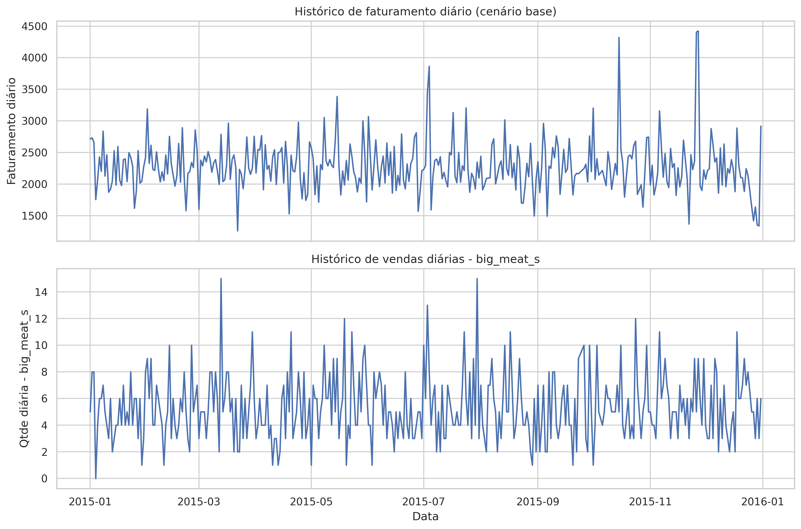
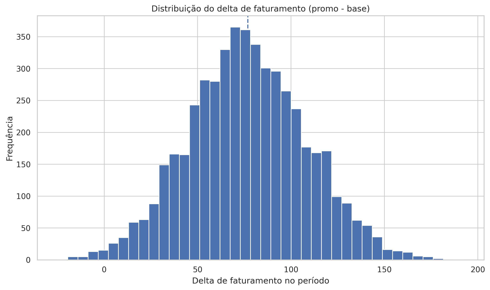
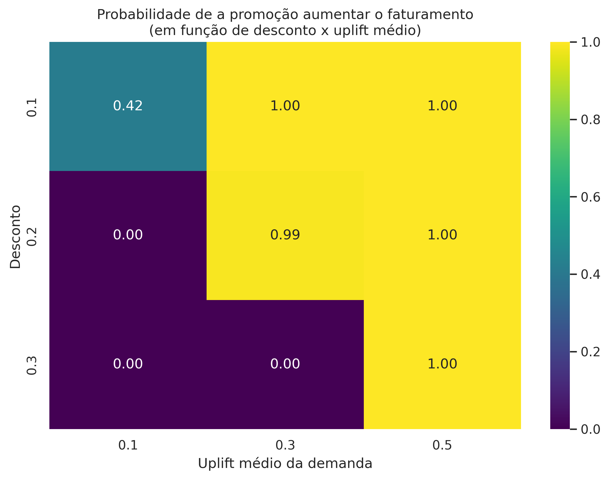
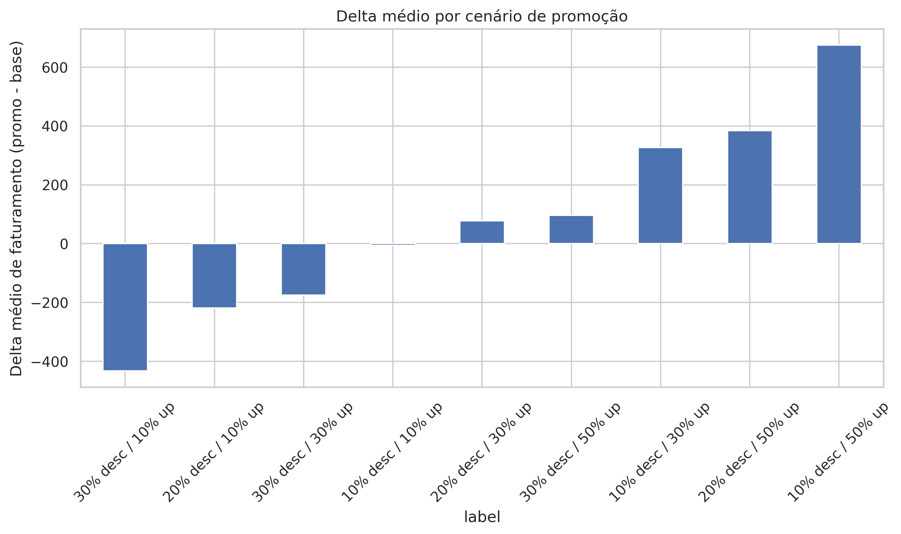

## N3 - Pesquisa Operacional
## Professor Jaison
## Alunos:
# Alberto Zilio
# Roni Pereira

# Análise de Promoção de Pizza com Simulação de Monte Carlo

## 1. Objetivo

Avaliar o impacto de uma promoção aplicada a uma pizza específica (`big_meat_s`) sobre o faturamento da pizzaria, considerando a incerteza
na demanda. Utilizamos simulação de Monte Carlo para comparar os cenários com e sem promoção.

## 2. Dataset e preparação

- Fonte: dados de um ano de vendas de uma pizzaria.
- Tabelas originais: `orders`, `order_details`, `pizzas`, `pizza_types`.
- Foi criado um dataset unificado `df`, incluindo data, hora, pizza, quantidade, preço, tipo e categoria.
- A partir desse dataset, construímos a série histórica de faturamento diário e de vendas diárias da pizza alvo.

A série base (faturamento diário + quantidade diária da pizza alvo) foi exportada em:

- `outputs/base_series.csv`

### 2.1. Faturamento diário e vendas da pizza alvo

## 3. Metodologia de simulação de Monte Carlo

1. Utilizamos o histórico diário de faturamento (`daily_revenue`) e a quantidade diária da pizza alvo (`daily_qty_target`).
2. Para cada dia simulado, sorteamos aleatoriamente um dia do histórico.
3. Separamos a receita da pizza alvo da receita das demais pizzas.
4. Aplicamos um desconto na pizza alvo e modelamos o aumento de demanda em função da promoção, por meio de uma variável aleatória (uplift ~ Normal).
5. Recalculamos o faturamento diário com promoção.
6. Repetimos o processo para um horizonte de vários dias (por exemplo, 30 dias) e para milhares de simulações.

### 3.1. Distribuição do delta de faturamento (promo - base)

O resumo numérico da simulação principal está disponível em:

- `outputs/resumo_monte_carlo.csv`

## 4. Análise de sensibilidade (desconto x aumento de demanda)

Foram avaliados diferentes cenários combinando níveis de desconto (10%, 20%, 30%)
com diferentes hipóteses de aumento médio de demanda (10%, 30%, 50%).

### 4.1. Tabela de cenários de promoção

|   desconto_% |   uplift_mean_% |   fat_base_medio |   fat_promo_medio |   delta_medio |   prob_melhora_% |   delta_q5 |   delta_q50 |   delta_q95 |
|-------------:|----------------:|-----------------:|------------------:|--------------:|-----------------:|-----------:|------------:|------------:|
|           10 |              10 |          68513.7 |           68507.9 |      -5.82595 |            41.75 |   -54.0968 |    -7.07833 |     45.8848 |
|           10 |              30 |          68443.7 |           68770.7 |     326.913   |           100    |   255.587  |   325.475   |    405.084  |
|           10 |              50 |          68556.7 |           69231.3 |     674.544   |           100    |   571.541  |   672.59    |    783.828  |
|           20 |              10 |          68595.8 |           68377.2 |    -218.572   |             0    |  -274.695  |  -217.501   |   -167.62   |
|           20 |              30 |          68559.2 |           68636.4 |      77.2058  |            99.05 |    26.3634 |    76.1289  |    132.823  |
|           20 |              50 |          68601.5 |           68985.5 |     384.02    |           100    |   314.72   |   381.329   |    457.412  |
|           30 |              10 |          68552.5 |           68120.3 |    -432.191   |             0    |  -502.399  |  -430.975   |   -364.143  |
|           30 |              30 |          68587.8 |           68413.4 |    -174.431   |             0    |  -226.543  |  -173.445   |   -124.985  |
|           30 |              50 |          68568.8 |           68665.4 |      96.5858  |           100    |    50.0087 |    95.9564  |    143.421  |

### 4.2. Probabilidade de a promoção aumentar o faturamento

### 4.3. Delta médio por cenário de promoção

## 5. Conclusões

- A simulação de Monte Carlo permitiu quantificar o impacto esperado da promoção, considerando a variabilidade tanto da demanda quanto da resposta à promoção.
- A partir dos cenários, é possível identificar faixas de desconto e aumento de demanda
  em que a probabilidade de ganho é alta, bem como situações em que o risco de perda é relevante.
- Esse tipo de análise apoia decisões de marketing e precificação com base em distribuições de resultados,
  e não apenas em valores médios.

